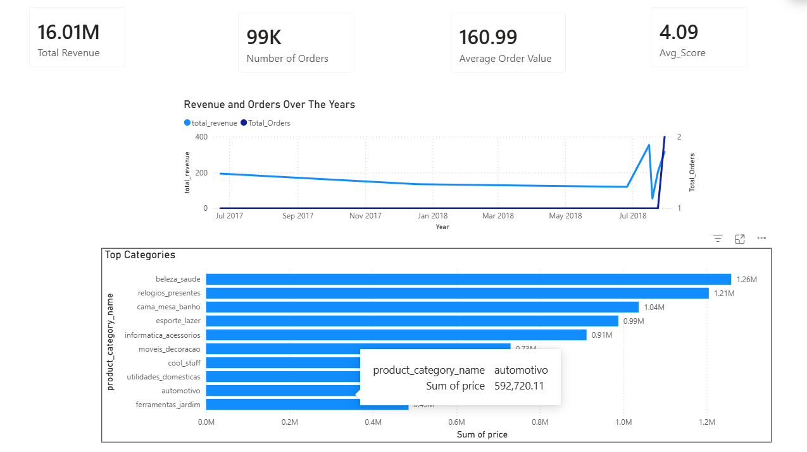
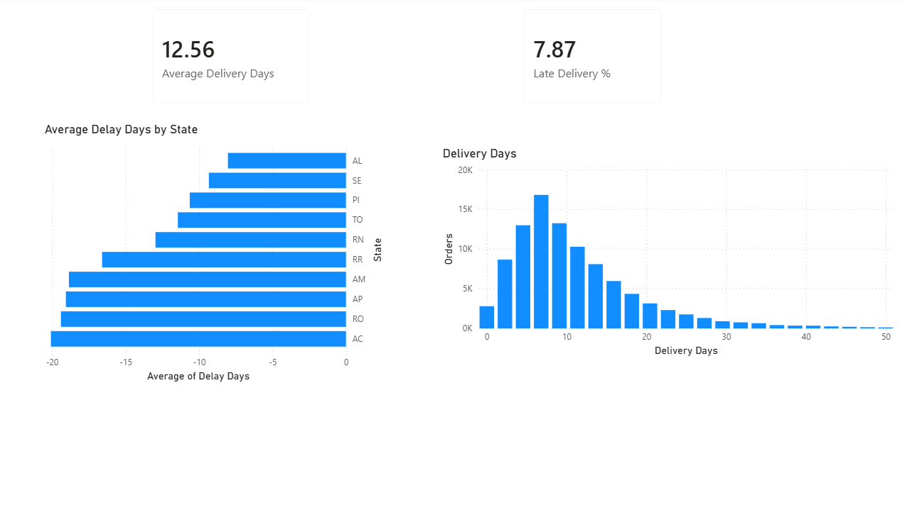
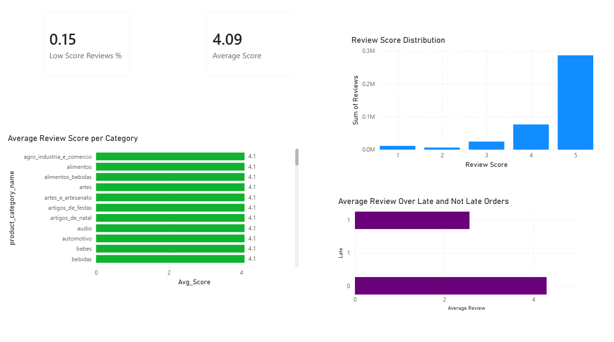

# End-to-End E-Commerce Analytics Pipeline

End-to-end e-commerce analytics project using the real **Olist** Brazilian marketplace dataset: data cleaning, exploratory analysis, statistical insights, and an interactive Power BI dashboard to answer business questions on revenue, customer behavior, delivery performance, and satisfaction.

---

## Project Overview

This portfolio project demonstrates a full analytics workflow from raw data to actionable dashboards. It is designed to showcase skills relevant to **junior data analyst** and **data scientist** roles: data cleaning with Pandas, exploratory data analysis (EDA), visualization, and BI reporting.

---

## Business Problem

**Context:** Olist is an online marketplace connecting sellers to customers across Brazil. Management needs to understand performance and improve revenue, customer satisfaction, and operational efficiency.

**Core question:** *How can Olist increase revenue and customer lifetime value while reducing delivery delays and improving satisfaction across product categories and regions?*

**Key areas addressed:**
- **Revenue & sales** — trends, top categories, geographic performance
- **Customer behavior** — order patterns, repeat vs one-time buyers
- **Operations** — delivery time vs estimated, on-time rate, delay hotspots
- **Satisfaction** — review scores and their relationship to delivery performance

---

## Dataset

- **Source:** [Brazilian E-Commerce Public Dataset by Olist](https://www.kaggle.com/datasets/olistbr/brazilian-ecommerce) (Kaggle)
- **Scope:** Historical orders, customers, products, sellers, payments, and reviews
- **Tables used:** orders, order_items, customers, products, sellers, order_payments, order_reviews

Raw data is placed in `data/raw/` after download. Processed and Power BI–ready outputs are in `data/processed/` and `data/powerbi/`.

---

## Tools Used

| Layer        | Tool / Stack        |
|-------------|----------------------|
| Data cleaning & EDA | Python, Pandas, NumPy |
| Visualization (EDA) | Matplotlib, Seaborn   |
| BI & reporting      | Power BI Desktop      |
| Environment         | Jupyter, venv         |

---

## Repository Structure

```
ecommerce-analytics-pipeline-olist/
├── README.md
├── requirements.txt
├── data/
│   ├── raw/                 # Original Olist CSVs (not in repo)
│   ├── processed/           # Cleaned tables from Phase 1
│   └── powerbi/             # Star-schema mart for Power BI
├── notebooks/
│   ├── 01_data_loading_and_cleaning.ipynb
│   └── 02_eda_and_kpis.ipynb
├── src/
│   ├── __init__.py
│   └── build_powerbi_mart.py   # Builds fact/dim tables for Power BI
├── powerbi/
│   ├── ecommerce_dashboard.pbix
│   └── screenshots/
├── docs/
│   ├── data_dictionary.md
│   ├── architecture.md
│   ├── kpi_definitions.md
│   └── insights_report.md
└── sql/                        # Optional / legacy
```

---

## Pipeline Architecture

1. **Ingestion & cleaning (Python)** — Load raw CSVs, standardize column names, parse dates, handle duplicates, export cleaned tables to `data/processed/`.
2. **EDA & KPIs (Jupyter)** — Exploratory analysis, distributions, time series, and business KPIs (revenue, AOV, delivery time, on-time %, review scores).
3. **Power BI mart (Python)** — Script `src/build_powerbi_mart.py` builds fact and dimension tables (e.g. `fact_orders`, `fact_order_items`, `dim_customers`, `dim_date`) and writes them to `data/powerbi/`.
4. **Dashboard (Power BI)** — Load mart CSVs, model relationships, define DAX measures, and build report pages: Executive Overview, Operations/Delivery, Customer & Satisfaction.

See [docs/architecture.md](docs/architecture.md) for more detail.

---

## How to Run

### Prerequisites

- Python 3.10+
- Jupyter (optional, for notebooks)
- Power BI Desktop (for the dashboard)

### Setup

```bash
# Clone the repo and enter the project folder
cd ecommerce-analytics-pipeline-olist

# Create and activate a virtual environment (Windows PowerShell)
python -m venv .venv
.\.venv\Scripts\activate

# Install dependencies
pip install -r requirements.txt
```

### Data

1. Download the [Olist dataset from Kaggle](https://www.kaggle.com/datasets/olistbr/brazilian-ecommerce) and place the CSVs in `data/raw/`.
2. Run the cleaning notebook: `notebooks/01_data_loading_and_cleaning.ipynb` → outputs in `data/processed/`.
3. (Optional) Run EDA: `notebooks/02_eda_and_kpis.ipynb`.
4. Build the Power BI mart:
   ```bash
   python src/build_powerbi_mart.py
   ```
   Outputs appear in `data/powerbi/`.
5. Open `powerbi/ecommerce_dashboard.pbix` in Power BI Desktop and set the data source path to `data/powerbi/` if needed, then refresh.

---

## Key Insights

- **Revenue & orders** — Monthly GMV and order count trends; top product categories by revenue.
- **Delivery** — Average delivery time, on-time delivery rate, and states with the highest average delay.
- **Satisfaction** — Average review score; late deliveries associated with lower scores.

A short narrative summary is in [docs/insights_report.md](docs/insights_report.md). KPI definitions are in [docs/kpi_definitions.md](docs/kpi_definitions.md).

---

## Dashboard

The Power BI report has three main pages:

| Page | Focus |
|------|--------|
| **Executive Overview** | Revenue, orders, AOV, on-time %, avg review; revenue trend; top categories; slicers (date, state, category) |
| **Operations & Delivery** | Avg delivery days, late %; delivery distribution; delay by state |
| **Customer & Satisfaction** | Avg review score, % low reviews; score distribution; score by category; score vs delivery status |

### Screenshots

- **Executive Overview**  
  

- **Operations & Delivery**  
  

- **Customer & Satisfaction**  
  

---

## Documentation

| Document | Description |
|----------|--------------|
| [docs/data_dictionary.md](docs/data_dictionary.md) | Tables and columns used in the pipeline and Power BI mart |
| [docs/architecture.md](docs/architecture.md) | End-to-end pipeline and data flow |
| [docs/kpi_definitions.md](docs/kpi_definitions.md) | Definitions and calculation of business KPIs |
| [docs/insights_report.md](docs/insights_report.md) | Summary of analytical findings |

---

## License & Data

- Project code: use as you like for portfolio and learning.
- Olist dataset: follow [Kaggle dataset terms](https://www.kaggle.com/datasets/olistbr/brazilian-ecommerce) and cite Olist when referencing the data.

---
